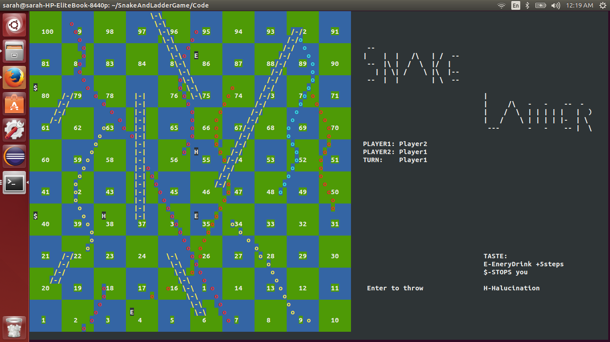

# SnakeAndLadderGame
Inter Process Communication(IPC) game.
Developed the traditional SNAKE and LADDERS using the concept of Shared Memory of IPC. The graphic of the game is supported by NCURSES libraries.

##To install Ncurses on linux(Ubuntu)
sudo apt-get install libncurses-dev
sudo apt-get update
sudo apt-get install ncurses-dev

##To run the game
1. Open 3 terminals, the third one in full screen mode.
2. Run the first player on 1st terminal gcc sulluplay1.c -o p1 -lncurses
3. On the 1st terminal run ./p1, enter the first player's name, and then minimize this terminal
3. Run the second player on 2nd terminal gcc sulluplay1.c -o p1 -lncurses
4. On the 2nd terminal run ./p2, enter the second player's name, and then minimize this terminal
5. Run the game board on the 3rd terminal gcc bor.c -o board -lncurses
6. On the 3rd terminal run ./board. Let the game begin!

